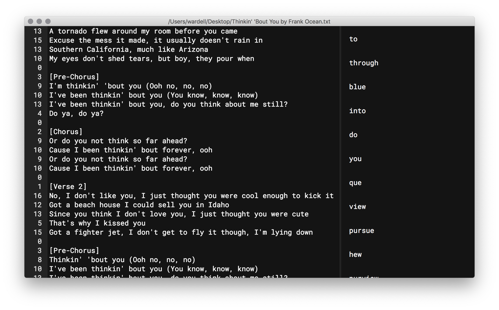

# Rhymer


An Electron application to help you write lyrics.

## Help me write lyrics?

Yeah! Poetry, rap, 2019-post-modern-ska-but-with-more-flutes? Whatever you want to write, Rhymer helps!

### What does it do?

Rhymer offers two main features:

1. Syllable count.
2. Rhyming dictionary.

Rhymer gives syllable counts on a per-line basis. Where most text editors would show the line number, Rhymer instead shows the syllable count for that line. Rhymer also provides an automatic rhyming dictionary; it will show you the rhymes for the word before the current cursor position or for the currently highlighted word. 

## Getting Started

```
git checkout https://github.com/wardellbagby/rhymer.git
cd rhymer
npm install
npm start
```

It's that easy!

Lint can be run using:

```
npm run lint
```

## Installing
Check the [releases page](https://github.com/wardellbagby/rhymer/releases) for releases.

Note: Only the macOS version is officially supported and tested. Linux and Windows versions are available, but not currently officially supported.

## License

This project is licensed under the GPL-3.0 License - see the [LICENSE](LICENSE.md) file for details

[](https://forthebadge.com)
