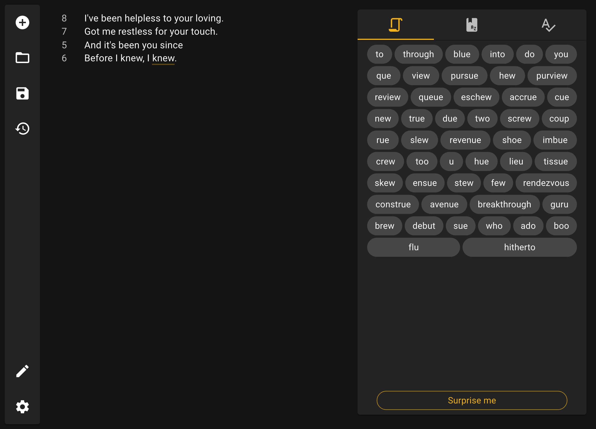

# Lyricistant


An assistant to the lyricist in you!

[](https://lyricistant.app/#download)
[](https://lyricistant.app/#download)
[](https://github.com/wardellbagby/lyricistant/blob/main/LICENSE.md)
[](https://github.com/wardellbagby/lyricistant/actions?query=workflow%3A%22Continuous+Integration%22)

## What is it?

Lyricistant is a writing app geared toward helping you write lyrics, poetry, or anything else you desire!

Unlike other apps with a focus on rhyming, Lyricistant is first and foremost a writing app. It's made for you to use to 
write your lyrics, while offering helpful features to keep you in the writing zone.

Its features include:
- Showing the amount of syllables per line.
- Contextually displaying rhymes as you type or select words.
- Easily saving and reopening lyrics that you've made.
- Drag and Drop support for quickly reopening lyrics.
- _[Desktop Only]_ Remembering your recently opened lyrics to help you continue where you left off.
- Both a light and dark theme that it can automatically switch between.
- Automatically updating.
- Available on your favorite platforms!
  - [Mac](https://lyricistant.app/#download)
  - [Windows](https://lyricistant.app/#download)
  - [Linux](https://lyricistant.app/#download)
  - [And your computer browser!](https://lyricistant.app)
  - _Android / iOS coming soon!_

## How can I use it?

#### [Check it out in your browser now!](https://lyricistant.app)  
#### [Download it to your computer!](https://lyricistant.app/#download)

## What's up with the name?

It's a combination of two words:

- Lyricist
- Assistant

Lyricistant!


## Information for developers
### Getting Started

This project uses [Gulp](https://gulpjs.com/) to build. 

The easiest way to use Gulp is via installing Gulp globally via `npm install -g gulp`, but this isn't required as `Gulp` is included as a dev dependency for this project, and so doing `npm install; node_modules/.bin/gulp <task>` will also work.

How to check out and run the project:
```shell
git checkout https://github.com/wardellbagby/lyricistant.git
cd lyricistant
# Starts the Electron app for development.
gulp startElectron
# Starts the Web app for development.
gulp startWeb
```

If you use a Jetbrains IDE (WebStorm, IntelliJ IDEA, etc) or Visual Studio Code, you can build and attach a debugger for all of these tasks natively in the IDE (via either Run Configurations for Jetbrains products or Run & Debug for Visual Studio Code).


### Viewing the latest on `main`

New commits to `main` are automatically deployed, both on the web and as native binaries.

- [Web](https://dev.lyricistant.app)  
- [Native binaries](https://github.com/wardellbagby/lyricistant/releases/tag/latest)
### Running Tests
There are currently unit and UI tests in the project.

You can run all tests in a terminal via:

```shell
gulp testAll
```

There are also run the tests natively in your IDE, which will make it easier to attach a debugger.

If you'd like to attach a debugger while testing via terminal:

```shell
node --inspect-brk ./node_modules/.bin/gulp testAll # Replace testAll with whatever command you'd like.
```

### React Devtools for Electron

In order to use React Devtools on Electron, this app includes the `react-devtools` dependency. When starting the Electron app, the app will automatically try to connect to a running React Devtools instance. You can start an instance of React Devtools by running `node_modules/.bin/react-devtools`, and start the app in a different terminal by running `gulp startElectron`.

### Updating dependencies

There's a helper script at `bin/install-latest.ts` that can be used to update all dependencies in the project that start with a specific string to a specified version.

This is very useful for updating any scoped NPM dependencies that should be updated in lockstep (i.e., `@codemirror`).

Example usage:

```shell
./bin/install-latest.ts @codemirror 18.1.0
```


## License

This project is licensed under the GPL-3.0 License - see the [LICENSE](LICENSE.md) file for details

[](https://forthebadge.com)
